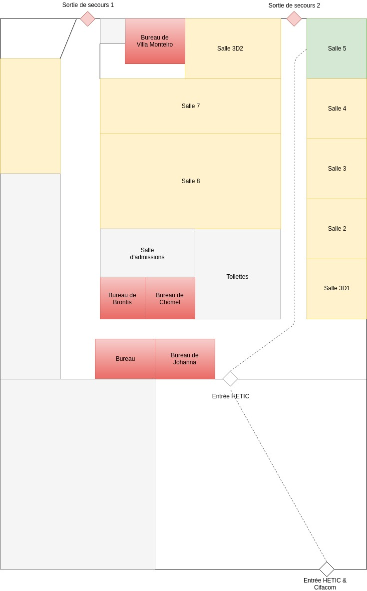

# Am I late ?

Web application made with Symfony 4 and React using Docker.

The api server listen to port 8000 and the front app to port 3000.

## The story

Rise and shine, 9 AM and your hand can't make it to the alarm clock before the voices in your head start telling you that its too early, too dark and too cold to get out of bed. The voice you have chosen to listen to is one of defiance. The voice that says there was a reason you set that alarm in the first place. So sit up, put your feet on the floor and don't look back because we've got work to do. You are Ariel, a teacher at HETIC. You had a class at 9 AM but you're late. So late. You have to get into the class without meeting any of the administration members. You finally get out of the bed, it's half past 9.

You have to get into the class **before** 10 AM. Welcome to the grind.

## Installation

~~~
$ git clone https://github.com/SundownDEV/Am-I-late
$ cd Am-I-late/
$ composer install && npm install
~~~

## Usage

Start the API

~~~
make api-start
~~~

Start the front app (client)

~~~
make front-run
~~~

Build assets

~~~
make front-build
~~~

Load test data fixtures

~~~
php bin/console doctrine:fixture:load
~~~